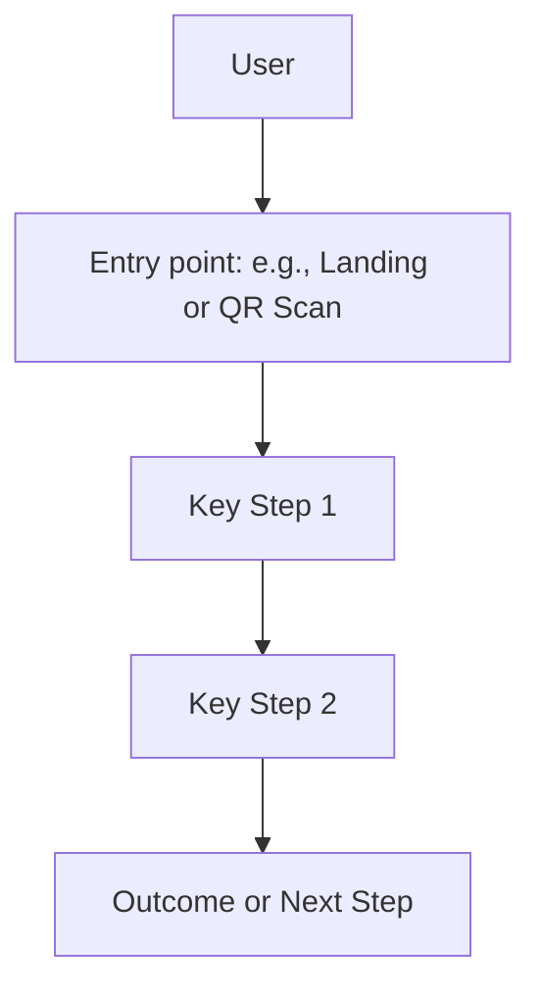
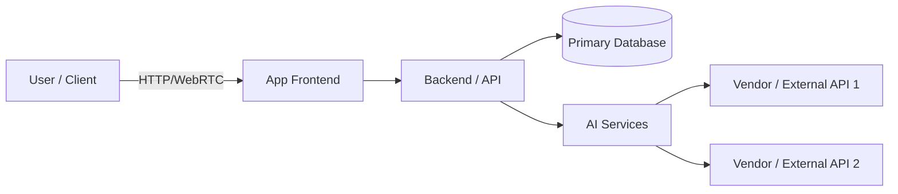
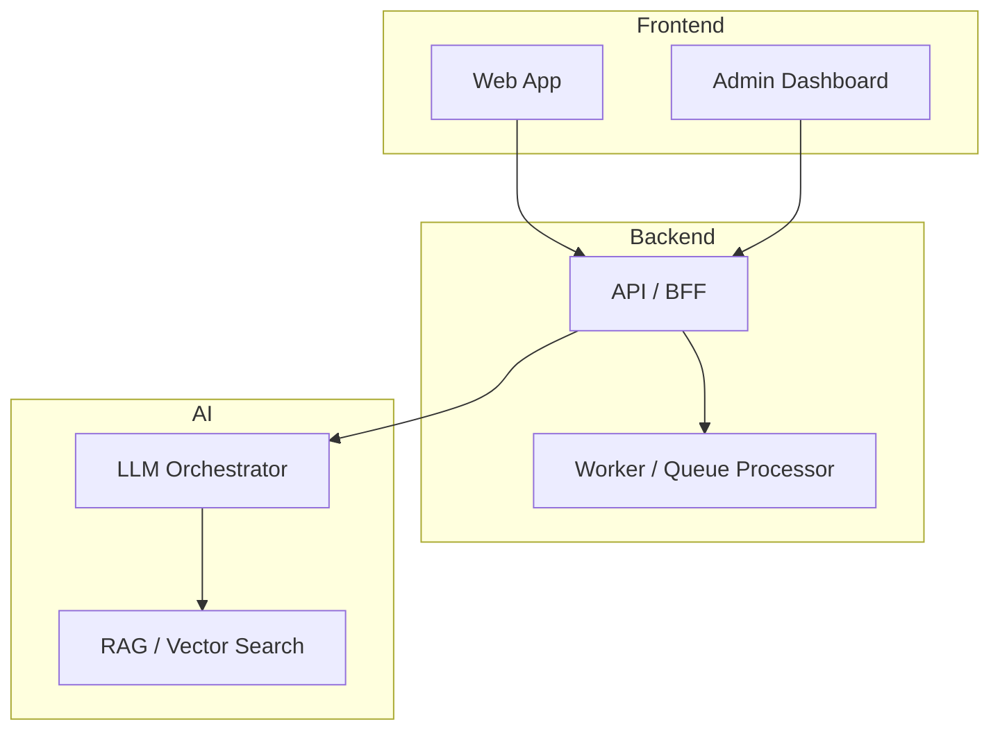
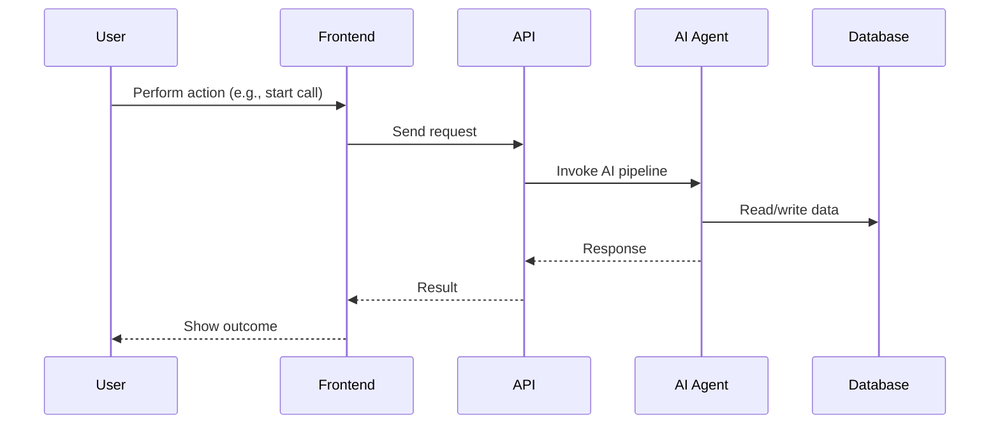
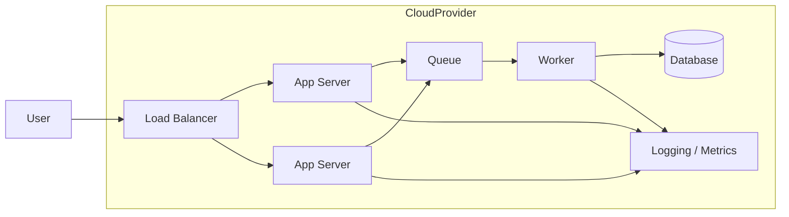

# 76 – System Maps & Visual Diagrams

> This doc is the **visual cockpit** for the project.
> Every time the architecture, flows, or key journeys change,
> update the diagrams here so humans *and* AI can see the system at a glance.

---

## 1. Purpose

- Give a **visual overview** of the product, from user journeys to system internals.
- Help Vibe coders, Pro builders, and AI tools understand:
  - What the main flows are.
  - Which components exist and how they talk to each other.
  - Where data moves and where risks hide.
- Act as the **source diagrams** that can be reused in docs, decks, and marketing.

---

## 2. When to Use / Update This Doc

- After initial onboarding: create **very rough** diagrams from the kernel.
- When you add/remove major features.
- Before and after big refactors (so you can compare "before" vs "after").
- Before a launch, demo, or handoff to another team.

---

## 3. Diagram Types We Use

Use Mermaid for all diagrams so they can be edited as text:

1. **Product / User Flow** – how users move through the app.
2. **System Context Diagram** – high-level boxes and arrows.
3. **Component Diagram** – main services, modules, or front/back pieces.
4. **Sequence Diagram** – step-by-step call flows (e.g., signup, voice call).
5. **Deployment / Infra Diagram** – environments, services, queues, etc. (Pro tier).

You do **not** need all of these on day one.
Start with Product Flow + System Context, then grow as the project matures.

---

## 4. Product / User Flow (Mermaid)

Describe the main user journey (or the MVP one) visually.

- Replace nodes with real labels ("Scan QR", "Talk to Voice Agent", "Receive Email Summary").
- For complex products, you can maintain **multiple flows**: e.g., New User, Returning User, Admin.

You may keep short bullets under the diagram explaining important edge cases.

---

## 5. System Context Diagram (Mermaid)

Show how the product sits among external systems and services.

Customize nodes to your actual stack (e.g., "Next.js", "Supabase", "LiveKit", "Deepgram").

---

## 6. Component Diagram (Mermaid)

Break the system into core logical components.

Keep labels generic-but-meaningful so AI can map them to code modules later.

---

## 7. Sequence Diagram (Mermaid)

Use sequence diagrams for critical flows (signup, checkout, call routing, etc.).

Create one diagram per important flow. Name them clearly.

---

## 8. Deployment / Infra Diagram (Mermaid, Optional)

For Pro / Infra-heavy builds, include a deployment diagram.

Adapt to Vercel, Supabase, Fly.io, etc.

---

## 9. How AI Should Use This Doc

For tools like Cursor, Windsurf, Cline, etc.:

- When asked to change architecture or major flows:
  - **Read this doc + AGENTS.md + architecture docs** first.
  - Keep diagrams and code **conceptually aligned** (even if diagrams lag).
- This doc is **advisory but important** – if code diverges from diagrams, the AI should:
  - Mention the divergence.
  - Optionally propose updated diagrams (using Mermaid) to keep things in sync.

For onboarding flows, you can use AI prompts (see helper prompts in Step 7)
to auto-generate **first drafts** of these diagrams from the kernel.

---

## 10. Definition of Done

This doc is "good enough" when:

- At least **2–3 diagrams** exist:
  - One Product/User flow.
  - One System Context.
  - Optionally Component or Sequence for the main MVP path.
- Diagrams reflect the **current** MVP state.
- The founder / tech lead agrees that a new dev could look here and "get it" in under 5 minutes.

Update diagrams as you ship major features or refactor the system.
