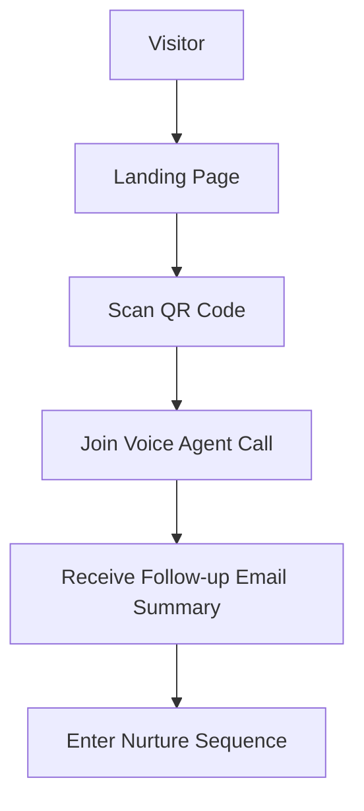

# Example – Product / User Flow

```mermaid
flowchart TD
    U[Visitor] --> L[Landing Page]
    L --> QR[Scan QR Code]
    QR --> CALL[Join Voice Agent Call]
    CALL --> SUMMARY[Receive Follow-up Email Summary]
    SUMMARY --> NURTURE[Enter Nurture Sequence]
```
