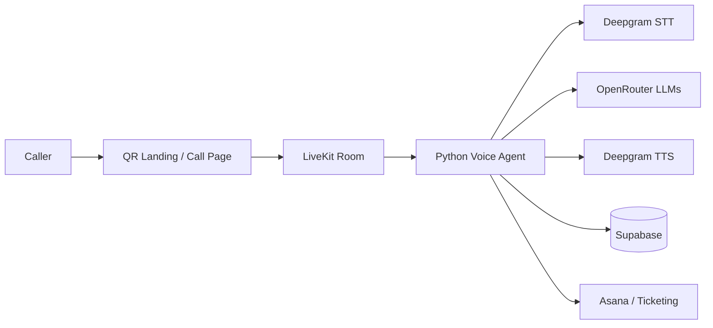

# Example – System Context Diagram

```mermaid
flowchart LR
    User[Caller] --> Web[QR Landing / Call Page]
    Web --> LK[LiveKit Room]
    LK --> Agent[Python Voice Agent]
    Agent --> STT[Deepgram STT]
    Agent --> LLM[OpenRouter LLMs]
    Agent --> TTS[Deepgram TTS]
    Agent --> DB[(Supabase)]
    Agent --> Tasks[Asana / Ticketing]
```
