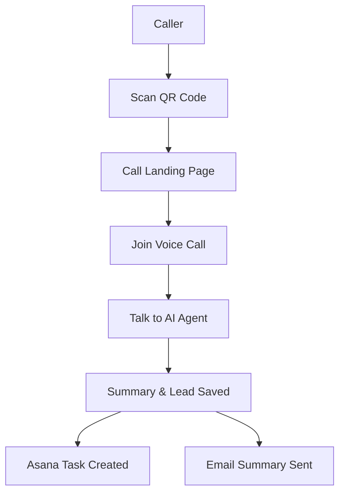
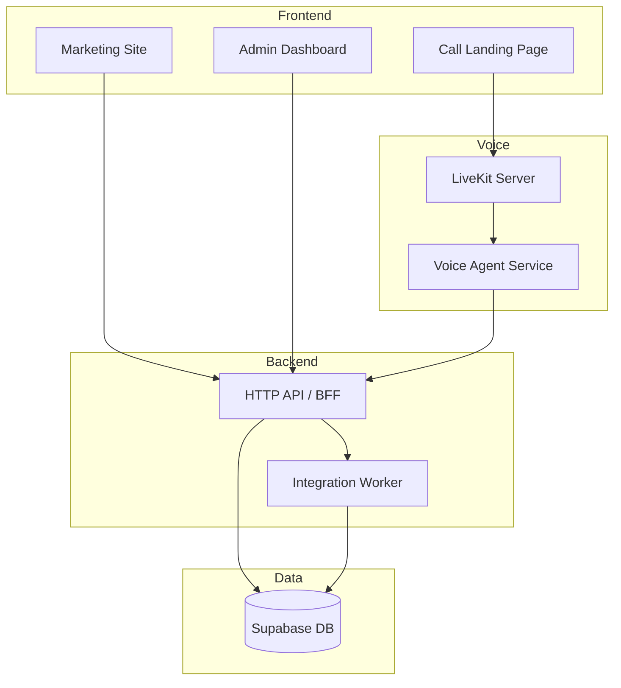
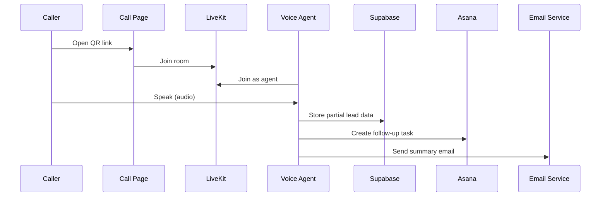

# 76 – System Maps & Visual Diagrams

> Visual cockpit for Quantum Voice AI. Keep these diagrams in sync
> with the current MVP behavior.

## 4. Product / User Flow (Mermaid)



- Main MVP path from scan → call → summary.
- As system grows, additional branches can be added.

## 5. System Context Diagram (Mermaid)

```mermaid
flowchart LR
    Caller[Caller] --> Web[QR Call Page (Next.js)]
    Web --> LK[LiveKit Room]
    LK --> Agent[Voice Agent Backend]
    Agent --> STT[Deepgram STT]
    Agent --> LLM[AI Router / LLMs]
    Agent --> TTS[Deepgram TTS]
    Agent --> DB[(Supabase)]
    Agent --> Asana[Asana API]
    Agent --> Email[Email Provider]
```

- Shows all major external dependencies for MVP.

## 6. Component Diagram (Mermaid)



## 7. Sequence Diagram (Mermaid)



These diagrams are starting points; update them as architecture evolves.
